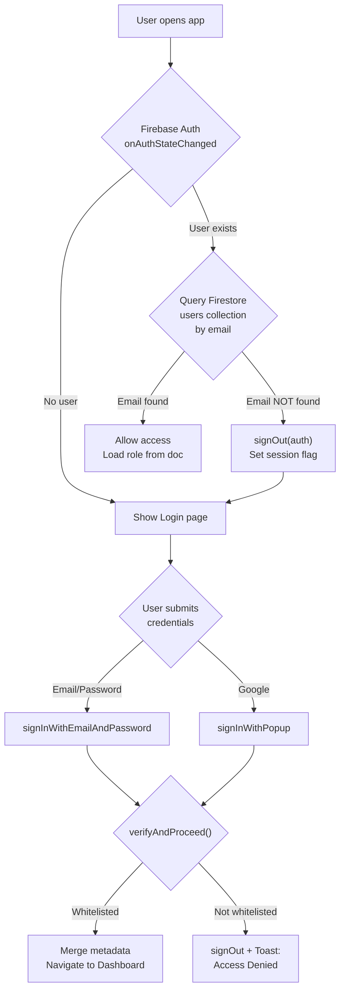
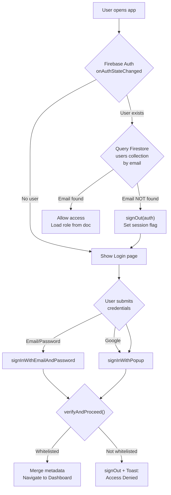

# Walkthrough: Phase 1, Phase 2 & Phase 3

## Phase 1 — Private Authentication

## Summary

Implemented private authentication so that **only pre-registered users** in the Firestore `users` collection can access the application. Public signup has been removed.

---

## Files Modified

### [DELETE] [Signup.jsx](file:///c:/Users/Elayaraja%20G/OneDrive/Documents/Wedding%20Moi%20project/src/pages/Auth/Signup.jsx)
- Deleted entirely. The app no longer allows anyone to create an account from the UI.

---

### [MODIFY] [Login.jsx](file:///c:/Users/Elayaraja%20G/OneDrive/Documents/Wedding%20Moi%20project/src/pages/Auth/Login.jsx)
**What changed:**
- Added an **Email / Password login form** with labeled inputs.
- Kept the existing **Google Sign-In** button (moved to secondary position below a divider).
- Added a shared `verifyAndProceed()` function that runs after **both** auth methods:
  1. Queries the Firestore `users` collection by email.
  2. If not found → signs the user out immediately and shows: *"Access Denied. Please contact the administrator."*
  3. If found → merges auth metadata (`uid`, `displayName`, `photoURL`, `role`) into the existing user doc and navigates to the dashboard.
- Reads a `sessionStorage` flag (`hp_access_denied`) on mount to show the access-denied toast when redirected from `App.jsx`.

---

### [MODIFY] [App.jsx](file:///c:/Users/Elayaraja%20G/OneDrive/Documents/Wedding%20Moi%20project/src/App.jsx)
**What changed:**
- The `onAuthStateChanged` listener now performs a **whitelist validation** on every auth state change (including returning sessions and page refreshes).
- If the authenticated user's email is not found in the Firestore `users` collection:
  - Sets a `sessionStorage` flag so the Login page can display the toast.
  - Signs the user out via `signOut(auth)`.
  - Sets the user state to `null`.
- On network errors, the check is skipped gracefully to avoid locking out users in offline scenarios.

---

### [MODIFY] [PermissionContext.jsx](file:///c:/Users/Elayaraja%20G/OneDrive/Documents/Wedding%20Moi%20project/src/context/PermissionContext.jsx)
**What changed:**
- No longer hardcodes `ROLES.ADMIN`.
- Listens to `onAuthStateChanged` and queries the Firestore `users` collection for the logged-in user's document.
- Reads the `role` field from the user document and calls `setRole(normalizeRole(userData.role))`.
- Falls back to `ROLES.ADMIN` if the user document has no role field or on errors.

---

## Build Result

```
✓ built in 615ms
0 errors
```

## Lint Result

```
0 errors, 7 warnings (all pre-existing)
```

Pre-existing warnings include:
- `react(only-export-components)` on context files (4 warnings) — standard for React context patterns.
- Unused `orderBy` import in `storage.js` (1 warning).
- Unused `canExportReports` variable in `Database.jsx` (1 warning).
- `useToast` export in `Toast.jsx` (1 warning).

None of these are introduced by Phase 1 changes.

---

## Auth Flow Diagram



# Walkthrough: Phase 1 & Phase 2

## Phase 2 — User Management

## Summary

Implemented Phase 2: User Management. Created a dedicated Admin-only page for managing helpers (adding, editing, and disabling). Helper data is stored inside the Firestore `users` collection. Nav links are filtered dynamically depending on user roles, and non-admins are restricted from accessing the page.

---

## Files Modified / Added

### [NEW] [UserManagement.jsx](file:///c:/Users/Elayaraja%20G/OneDrive/Documents/Wedding%20Moi%20project/src/pages/UserManagement/UserManagement.jsx)
- A new page component accessible only to users with `admin` role (determined via permissions).
- Implements user listing in a structured table containing: Avatar initial, Name, Email, Role badge, Status badge, and Added On date.
- Contains an inline search bar to query users by name, email, or role.
- Contains dialog/modal forms to add a new helper or edit an existing one.
- Implements disable/enable functionality via a confirmation dialog.
- Follows the application's established UI component design patterns (`Card`, `Table`, `Badge`, `Modal`, `ConfirmDialog`, `Input`, `Button`, `Toast`).

---

### [MODIFY] [storage.js](file:///c:/Users/Elayaraja%20G/OneDrive/Documents/Wedding%20Moi%20project/src/services/storage.js)
- Added new Firebase data methods to manage documents in the Firestore `users` collection:
  - `subscribeToUsers`: Listens to real-time additions, updates, or deletions of users, sorted by `createdAt` descending.
  - `getUsers`: Fetches all user documents.
  - `createUser`: Validates input, checks for email duplicates, generates ID, and sets the fields (`name`, `email`, `role`, `active`, `createdAt`).
  - `updateUser`: Updates specified fields of a user doc. Normalizes names and emails, and checks for email uniqueness if updated.
  - `deleteUser`: Deletes a user document.

---

### [MODIFY] [permissions.js](file:///c:/Users/Elayaraja%20G/OneDrive/Documents/Wedding%20Moi%20project/src/services/permissions.js)
- Added the `MANAGE_USERS` permission constant.
- Granted `MANAGE_USERS` exclusively to the `ADMIN` role. Helper role permissions remain untouched.

---

### [MODIFY] [routes.js](file:///c:/Users/Elayaraja%20G/OneDrive/Documents/Wedding%20Moi%20project/src/constants/routes.js)
- Added the `/users` routing path constant: `USER_MANAGEMENT`.

---

### [MODIFY] [navItems.js](file:///c:/Users/Elayaraja%20G/OneDrive/Documents/Wedding%20Moi%20project/src/constants/navItems.js)
- Added the navigation item config for Users with an `adminOnly` flag.

---

### [MODIFY] [Sidebar.jsx](file:///c:/Users/Elayaraja%20G/OneDrive/Documents/Wedding%20Moi%20project/src/components/layout/Sidebar.jsx) and [MobileNav.jsx](file:///c:/Users/Elayaraja%20G/OneDrive/Documents/Wedding%20Moi%20project/src/components/layout/MobileNav.jsx)
- Integrated `usePermissions` and roles check to filter out nav links having the `adminOnly` flag for helper accounts.

---

### [MODIFY] [Header.jsx](file:///c:/Users/Elayaraja%20G/OneDrive/Documents/Wedding%20Moi%20project/src/components/layout/Header.jsx)
- Added breadcrumb mapping for the new `/users` route.

---

### [MODIFY] [App.jsx](file:///c:/Users/Elayaraja%20G/OneDrive/Documents/Wedding%20Moi%20project/src/App.jsx)
- Lazy loaded `UserManagement` page component.
- Registered the nested protected route for `ROUTES.USER_MANAGEMENT`.

---

## Build & Lint Results

- **Build**: Successfully bundled with no compilation errors.
- **Lint**: Checked with `oxlint`. Pre-existing warnings remain; no new lint warnings or errors were introduced.

---

## Auth Flow Diagram



---

## Phase 3 — Event Ownership

## Summary

Implemented Phase 3: Event Ownership. Restricted all visible events and entries to those owned by the currently logged-in user.

---

## Files Modified

### [MODIFY] [storage.js](file:///c:/Users/Elayaraja%20G/OneDrive/Documents/Wedding%20Moi%20project/src/services/storage.js)
- Restricted entries subscriptions (`subscribeToSortedEntries`) and fetches (`getSortedEntries`) to only return entries belonging to events owned by the current user when `eventId` is `null` (such as on the Dashboard page).
- This ensures data privacy and keeps other users' entries from being included in the dashboard total calculations, database backup exports, backup deletions, or resets.

---

## Build & Lint Results

- **Build**: Successfully compiled.
- **Lint**: Checked with `oxlint`. No warnings or errors introduced by Phase 3.

---

## Phase 4 — Event Sharing

## Summary

Implemented Phase 4: Event Sharing. Admins can now manage access to their events by sharing them with helper/other emails. Sharing access list is stored directly inside the event document, keeping Firestore real-time.

---

## Files Modified

### [MODIFY] [storage.js](file:///c:/Users/Elayaraja%20G/OneDrive/Documents/Wedding%20Moi%20project/src/services/storage.js)
- Added `shareEventWithEmail` and `unshareEventWithEmail` database helpers for both Firebase and localStorage fallback. They read, update, and write the array of shared helper emails (`sharedEmails`) inside the corresponding event document.
- Prevents duplicate email sharing inputs.

### [MODIFY] [EventView.jsx](file:///c:/Users/Elayaraja%20G/OneDrive/Documents/Wedding%20Moi%20project/src/pages/EventView/EventView.jsx)
- Changed the "Share Event" button action to open a new "Manage Access" modal.
- Within the modal, admins can:
  - Copy the event's shareable link to clipboard (with support for fallback APIs).
  - Share the event with a helper by inputting their email address.
  - View the list of all helpers who currently have access.
  - Revoke a helper's access by clicking the revoke icon button.
- Kept Firestore real-time updates intact so the shared list stays synced dynamically.

---

## Build & Lint Results

- **Build**: Successfully compiled with Vite.
- **Lint**: Verified with `oxlint` with 0 warnings or errors introduced by Phase 4.

---

## Phase 5 — Helper Event Visibility

## Summary

Implemented Phase 5: Helper Event Visibility. When a helper logs in, they only see events explicitly shared with them. Admins continue to see all events they own. Realtime sync updates visible items instantly.

---

## Files Modified

### [MODIFY] [storage.js](file:///c:/Users/Elayaraja%20G/OneDrive/Documents/Wedding%20Moi%20project/src/services/storage.js)
- Updated `getSortedEvents` and `subscribeToSortedEvents` Firestore queries to filter using a composite `or` query that checks if the logged-in user is the owner (`ownerId == uid`) OR if their email is in the `sharedEmails` list.
- Implemented corresponding filter conditions on local fallback databases (`localStorage` paths).
- Updated entries queries (`subscribeToSortedEntries` and `getSortedEntries` with `eventId === null`) to look up and display entries matching the same query logic (events where the user is either the owner or a shared helper).
- Implemented access checking inside `getEventById` so helpers cannot view non-assigned events directly.

---

## Build & Lint Results

- **Build**: Successfully compiled with Vite.
- **Lint**: Checked with `oxlint` with 0 warnings or errors introduced by Phase 5.

---

## Phase 6 — Permissions

## Summary

Implemented Phase 6: Role-based permissions. All UI actions are guarded using the centralized `PERMISSIONS` constants from `src/services/permissions.js` and the `usePermissions()` hook. Admins retain full control; helpers are restricted to their allowed set of actions and blocked from protected pages.

---

## Permission Matrix

| Action | Admin | Helper |
|---|---|---|
| Create Event | ✅ | ❌ (redirected) |
| Edit Event | ✅ | ❌ (button hidden) |
| Delete Event | ✅ | ❌ (button hidden) |
| Share Event | ✅ | ❌ (button hidden) |
| Add Guest Entries | ✅ | ✅ |
| Edit Guest Entries | ✅ | ✅ |
| Delete Guest Entries | ✅ | ❌ (button hidden) |
| Print Thermal Receipts | ✅ | ✅ |
| Export PDF | ✅ | ❌ (button hidden) |
| Export Excel | ✅ | ❌ (button hidden) |
| Export CSV | ✅ | ❌ (button hidden) |
| Access Settings | ✅ | ❌ (redirected to `/`) |
| Duplicate Event | ✅ | ❌ (button hidden) |

---

## Files Modified

### [MODIFY] [EventCreate.jsx](file:///c:/Users/Elayaraja%20G/OneDrive/Documents/Wedding%20Moi%20project/src/pages/EventCreate/EventCreate.jsx)
- Added `usePermissions` and `PERMISSIONS` imports.
- Redirects to `/` via `useEffect` if user lacks `EDIT_EVENT` permission.
- Returns `null` (renders nothing) while redirect resolves.
- All hooks are declared before the early return to comply with React Hook rules.

### [MODIFY] [Settings.jsx](file:///c:/Users/Elayaraja%20G/OneDrive/Documents/Wedding%20Moi%20project/src/pages/Settings/Settings.jsx)
- Added `useNavigate` import.
- Redirects to `/` via `useEffect` if user lacks `CHANGE_SETTINGS` permission.
- Returns `null` after all hooks are declared, before the loading/JSX return.

### [MODIFY] [Dashboard.jsx](file:///c:/Users/Elayaraja G/OneDrive/Documents/Wedding%20Moi%20project/src/pages/Dashboard/Dashboard.jsx)
- Added `usePermissions` and `PERMISSIONS` imports.
- Guarded the header "Create New Event" button with `EDIT_EVENT` permission.
- Guarded the empty-state "Create Event" button with `EDIT_EVENT` permission.

### [MODIFY] [EventHistory.jsx](file:///c:/Users/Elayaraja%20G/OneDrive/Documents/Wedding%20Moi%20project/src/pages/EventHistory/EventHistory.jsx)
- Guarded the header "Create New Event" button with `EDIT_EVENT` permission.
- Guarded the "Duplicate Event" card button with `EDIT_EVENT` permission.
- `DELETE_EVENT` and `PRINT_RECEIPT` buttons were already guarded.

---

## Build & Lint Results

- **Build**: Successfully compiled with Vite.
- **Lint**: Verified with `oxlint` — **0 errors, 6 pre-existing warnings** (unrelated to Phase 6).

---

## Phase 7 — Activity Log

## Summary

Implemented Phase 7: Activity Log auditing for guest entries. Every guest entry now logs who created and last updated it, including email/user IDs and ISO timestamps. This metadata is exposed to the user through hover tooltips on entry tables and directly inside the Edit modals.

---

## Audit Data Model

The following fields are recorded for each guest entry:
- `createdBy`: Unique identifier of the creating admin/helper.
- `createdByEmail`: Registered email of the creator.
- `createdAt`: ISO 8601 creation timestamp.
- `updatedBy`: Unique identifier of the updating user.
- `updatedByEmail`: Registered email of the updater.
- `updatedAt`: ISO 8601 update timestamp.

---

## Files Modified

### [MODIFY] [storage.js](file:///c:/Users/Elayaraja%20G/OneDrive/Documents/Wedding%20Moi%20project/src/services/storage.js)
- Updated `createEntry` to populate `createdBy`, `createdByEmail`, `createdAt`, `updatedAt: null`, `updatedBy: null`, and `updatedByEmail: null` in both local database and Firestore transaction paths.
- Updated `updateEntry` to set `updatedBy`, `updatedByEmail`, and `updatedAt` on modifications.

### [MODIFY] [EventView.jsx](file:///c:/Users/Elayaraja%20G/OneDrive/Documents/Wedding%20Moi%20project/src/pages/EventView/EventView.jsx)
- Added `title` attribute tooltip to table rows displaying who added/edited the contribution.
- Added a details block to the edit entry modal displaying creation and last edit metadata.

### [MODIFY] [Database.jsx](file:///c:/Users/Elayaraja%20G/OneDrive/Documents/Wedding%20Moi%20project/src/pages/Database/Database.jsx)
- Added `title` attribute tooltip to ledger table rows showing creation and edit history.
- Added audit logs inside the database edit modal before the save actions.

---

## Build & Lint Results

- **Build**: Successfully compiled with Vite.
- **Lint**: Verified with `oxlint` — **0 errors**.


